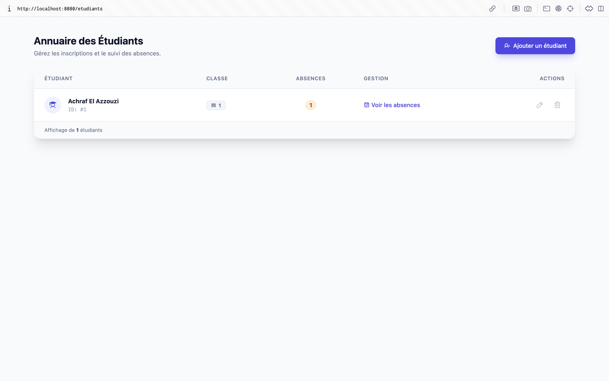
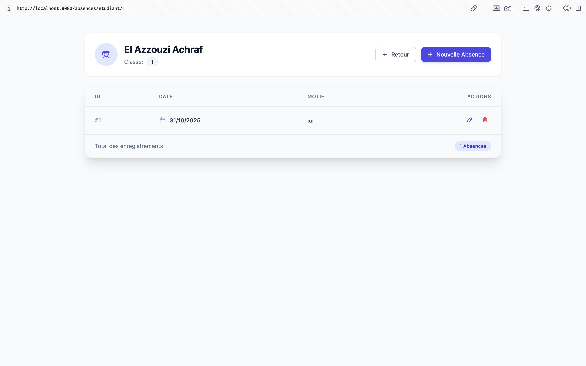
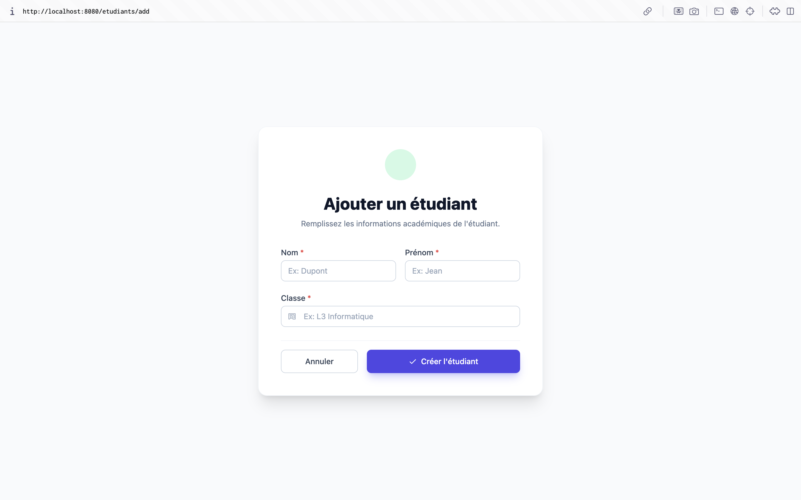
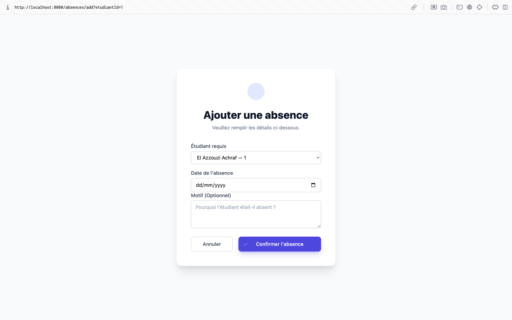

# 📚 Système de Gestion des Absences Étudiantes

Application web Spring Boot pour la gestion des étudiants et de leurs absences. Cette application permet de gérer efficacement les informations des étudiants et de suivre leurs absences avec une interface utilisateur moderne et intuitive.

## 📋 Table des matières

- [Description](#description)
- [Technologies utilisées](#technologies-utilisées)
- [Prérequis](#prérequis)
- [Installation](#installation)
- [Configuration](#configuration)
- [Structure du projet](#structure-du-projet)
- [Fonctionnalités](#fonctionnalités)
- [Utilisation](#utilisation)
- [Captures d'écran](#captures-décran)
- [Auteur](#auteur)

## 📝 Description

Cette application web permet de :
- Gérer les étudiants (CRUD complet)
- Gérer les absences des étudiants (CRUD complet)
- Visualiser les absences par étudiant
- Suivre le nombre total d'absences par étudiant

L'application utilise une architecture MVC (Model-View-Controller) avec Spring Boot et offre une interface utilisateur responsive construite avec Tailwind CSS.

## 🛠 Technologies utilisées

### Backend
- **Java 25**
- **Spring Boot 3.5.7**
- **Spring Data JPA** - Pour la gestion des données
- **Hibernate** - ORM (Object-Relational Mapping)
- **MySQL** - Base de données relationnelle
- **Maven** - Gestion des dépendances

### Frontend
- **Thymeleaf** - Moteur de template côté serveur
- **Tailwind CSS** — framework CSS utilitaire

### Outils
- **Lombok** - Réduction du code boilerplate
- **HikariCP** - Pool de connexions

## 📦 Prérequis

Avant de commencer, assurez-vous d'avoir installé :

- **JDK 25** ou supérieur
- **Maven 3.6+**
- **MySQL 8.0+** (ou MySQL 5.5.5 minimum, mais non recommandé)
- **IDE** (IntelliJ IDEA, Eclipse, VS Code, etc.)

## 🚀 Installation

### 1. Cloner le projet

```bash
git clone <url-du-repo>
cd Atelier6
```

### 2. Créer la base de données

Connectez-vous à MySQL et créez la base de données :

```sql
CREATE DATABASE absencedb CHARACTER SET utf8mb4 COLLATE utf8mb4_unicode_ci;
```

### 3. Configurer la base de données

Modifiez le fichier `src/main/resources/application.properties` avec vos paramètres de connexion :

```properties
spring.datasource.url=jdbc:mysql://localhost:3306/absencedb?useSSL=false&allowPublicKeyRetrieval=true&serverTimezone=Africa/Casablanca
spring.datasource.username=votre_username
spring.datasource.password=votre_password
```

### 4. Compiler et exécuter

#### Avec Maven :

```bash
# Compiler le projet
mvn clean install

# Lancer l'application
mvn spring-boot:run
```

#### Avec un IDE :

1. Importez le projet comme projet Maven
2. Configurez le JDK 25
3. Exécutez la classe `Atelier6Application`

### 5. Accéder à l'application

Une fois l'application démarrée, ouvrez votre navigateur et accédez à :

```
http://localhost:8080
```

L'application redirigera automatiquement vers la page de gestion des étudiants.

## ⚙️ Configuration

### Configuration de la base de données

Le fichier `application.properties` contient toutes les configurations nécessaires :

```properties
# Port du serveur
server.port=8080

# Configuration de la base de données
spring.datasource.url=jdbc:mysql://localhost:3306/absencedb
spring.datasource.username=root
spring.datasource.password=

# Configuration JPA/Hibernate
spring.jpa.hibernate.ddl-auto=update
spring.jpa.show-sql=true
spring.jpa.properties.hibernate.format_sql=true
```

### Mode de développement

- `spring.jpa.hibernate.ddl-auto=update` : Les tables sont créées/mises à jour automatiquement
- `spring.jpa.show-sql=true` : Affiche les requêtes SQL dans les logs
- `spring.thymeleaf.cache=false` : Désactive le cache des templates en développement

## 📁 Structure du projet

```
Atelier6/
│
├── src/
│   ├── main/
│   │   ├── java/
│   │   │   ├── controller/          # Contrôleurs Spring MVC
│   │   │   │   ├── EtudiantController.java
│   │   │   │   ├── AbsenceController.java
│   │   │   │   └── HomeController.java
│   │   │   │
│   │   │   ├── entities/            # Entités JPA
│   │   │   │   ├── Etudiant.java
│   │   │   │   └── Absence.java
│   │   │   │
│   │   │   ├── repository/          # Repositories Spring Data JPA
│   │   │   │   ├── EtudiantRepository.java
│   │   │   │   └── AbsenceRepository.java
│   │   │   │
│   │   │   ├── service/             # Services métier
│   │   │   │   ├── EtudiantService.java
│   │   │   │   └── EtudiantServiceImpl.java
│   │   │   │
│   │   │   └── ma/fstt/atelier6/
│   │   │       └── Atelier6Application.java
│   │   │
│   │   └── resources/
│   │       ├── application.properties
│   │       └── templates/           # Templates Thymeleaf
│   │           ├── etudiants/
│   │           │   ├── list.html
│   │           │   └── form.html
│   │           └── absences/
│   │               ├── list-etudiant.html
│   │               └── form.html
│   │
│   └── test/                        # Tests unitaires
│
├── pom.xml                          # Configuration Maven
└── README.md                        # Ce fichier

```

## Flux de Données

```
┌─────────────┐
│   Browser   │
└──────┬──────┘
       │ HTTP Request
       ▼
┌─────────────┐
│ Controller  │ ←─── Spring MVC
└──────┬──────┘
       │
       ▼
┌─────────────┐
│   Service   │ ←─── Logique métier
└──────┬──────┘
       │
       ▼
┌─────────────┐
│ Repository  │ ←─── Spring Data JPA
└──────┬──────┘
       │
       ▼
┌─────────────┐
│  Database   │ ←─── MySQL
└─────────────┘
```

## ✨ Fonctionnalités

### Gestion des Étudiants

- ✅ **Liste des étudiants** : Affichage de tous les étudiants avec leurs informations
- ✅ **Ajouter un étudiant** : Formulaire pour créer un nouvel étudiant
- ✅ **Modifier un étudiant** : Modification des informations d'un étudiant existant
- ✅ **Supprimer un étudiant** : Suppression d'un étudiant (avec confirmation)
- ✅ **Compteur d'absences** : Affichage du nombre total d'absences par étudiant

### Gestion des Absences

- ✅ **Liste des absences par étudiant** : Visualisation de toutes les absences d'un étudiant
- ✅ **Ajouter une absence** : Enregistrement d'une nouvelle absence
- ✅ **Modifier une absence** : Modification de la date et du motif d'une absence
- ✅ **Supprimer une absence** : Suppression d'une absence (avec confirmation)
- ✅ **Navigation intuitive** : Accès rapide aux absences depuis la liste des étudiants

### Interface Utilisateur

- 🎨 **Design moderne** : Interface utilisateur construite avec Tailwind CSS
- 📱 **Responsive** : Compatible avec tous les appareils (desktop, tablette, mobile)
- 🎯 **Classes utilitaires** Tailwind pour une mise en page rapide et cohérente
- ⚡ **Feedback visuel** : Messages de confirmation et indicateurs visuels

## 🎯 Utilisation

### Page d'accueil

L'application démarre sur la page de gestion des étudiants :
```
http://localhost:8080/etudiants
```

### Gestion des étudiants

1. **Ajouter un étudiant** :
   - Cliquez sur le bouton "Ajouter un étudiant"
   - Remplissez le formulaire (Nom, Prénom, Classe)
   - Cliquez sur "Enregistrer"

2. **Modifier un étudiant** :
   - Cliquez sur l'icône crayon (✏️) dans la colonne "Actions"
   - Modifiez les informations
   - Cliquez sur "Modifier"

3. **Supprimer un étudiant** :
   - Cliquez sur l'icône poubelle (🗑️) dans la colonne "Actions"
   - Confirmez la suppression

4. **Gérer les absences d'un étudiant** :
   - Cliquez sur le bouton "Gérer" dans la colonne "Gérer Absences"
   - Vous serez redirigé vers la page des absences de cet étudiant

### Gestion des absences

1. **Ajouter une absence** :
   - Depuis la liste des absences d'un étudiant, cliquez sur "Ajouter une absence"
   - Sélectionnez la date et entrez le motif (optionnel)
   - Cliquez sur "Enregistrer"

2. **Modifier une absence** :
   - Cliquez sur l'icône crayon (✏️) dans la colonne "Actions"
   - Modifiez la date et/ou le motif
   - Cliquez sur "Modifier"

3. **Supprimer une absence** :
   - Cliquez sur l'icône poubelle (🗑️) dans la colonne "Actions"
   - Confirmez la suppression

## 📸 Captures d'écran

### Page de gestion des étudiants
- Liste complète des étudiants avec leurs informations
- Compteur d'absences pour chaque étudiant
- Boutons d'action (Modifier, Supprimer, Gérer absences)



### Page de gestion des absences
- Liste des absences d'un étudiant spécifique
- Informations détaillées (Date, Motif)
- Total d'absences affiché



### Formulaires
- Interface claire et intuitive
- Validation des champs obligatoires
- Messages d'erreur appropriés






## 🔧 Résolution de problèmes

### Problème : Les tables ne sont pas créées

**Solution** : Vérifiez que :
- La base de données `absencedb` existe
- Les identifiants de connexion sont corrects dans `application.properties`
- `spring.jpa.hibernate.ddl-auto=update` est configuré

### Problème : Erreur de connexion à la base de données

**Solution** : 
- Vérifiez que MySQL est démarré
- Vérifiez l'URL de connexion dans `application.properties`
- Vérifiez les identifiants (username/password)

### Problème : Port 8080 déjà utilisé

**Solution** : Modifiez le port dans `application.properties` :
```properties
server.port=8081
```

## 📊 Modèle de données

### Entité Étudiant
- `id` : Identifiant unique (Long, auto-généré)
- `nom` : Nom de l'étudiant (String)
- `prenom` : Prénom de l'étudiant (String)
- `classe` : Classe de l'étudiant (String)
- `absences` : Liste des absences (OneToMany)

### Entité Absence
- `id` : Identifiant unique (Long, auto-généré)
- `dateAbs` : Date de l'absence (LocalDate)
- `motif` : Motif de l'absence (String, optionnel)
- `etudiant` : Référence à l'étudiant (ManyToOne) 

```
┌─────────────────────┐
│     Etudiant        │
├─────────────────────┤
│ - id: Long          │
│ - nom: String       │
│ - prenom: String    │
│ - classe: String    │
│ - absences: List    │
└──────────┬──────────┘
           │
           │ 1
           │
           │ *
           │
┌──────────▼──────────┐
│      Absence        │
├─────────────────────┤
│ - id: Long          │
│ - dateAbs: LocalDate│
│ - motif: String     │
│ - etudiant: Etudiant│
└─────────────────────┘
```


## 🔐 Sécurité

⚠️ **Note** : Cette application est conçue pour un environnement de développement. Pour la production, il est recommandé d'ajouter :
- Authentification et autorisation
- Validation des entrées utilisateur
- Protection CSRF
- Chiffrement des données sensibles

## 📝 Notes importantes

- **MySQL 5.5.5** : L'application fonctionne avec MySQL 5.5.5, mais il est recommandé d'utiliser MySQL 8.0+ pour une meilleure compatibilité avec Hibernate
- **Lazy Loading** : Les relations sont configurées avec un chargement paresseux (LAZY) pour optimiser les performances
- **Transactions** : Les services utilisent `@Transactional` pour garantir la cohérence des données

## 🚀 Améliorations futures

- [ ] Système d'authentification et d'autorisation
- [ ] Export des données (PDF, Excel)
- [ ] Statistiques et graphiques
- [ ] Recherche et filtrage avancés
- [ ] Notifications par email
- [ ] API REST pour intégration mobile
- [ ] Tests unitaires et d'intégration complets

